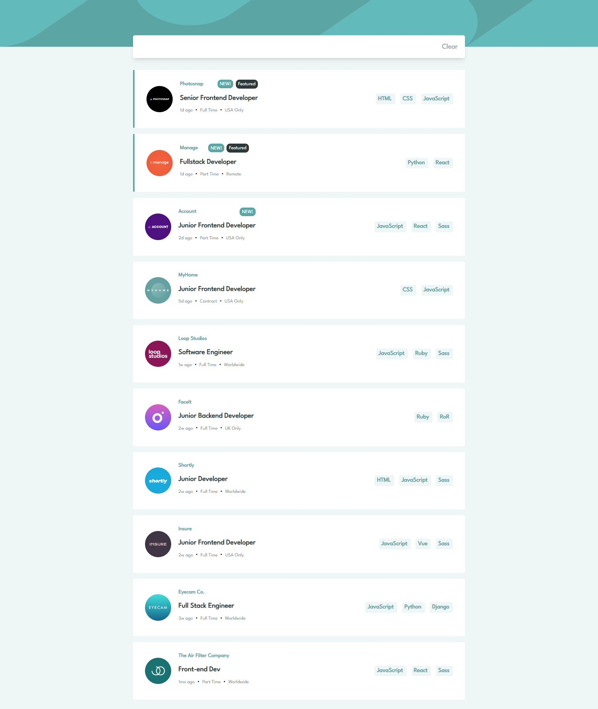

# React + Vite

This template provides a minimal setup to get React working in Vite with HMR and some ESLint rules.

Currently, two official plugins are available:

- [@vitejs/plugin-react](https://github.com/vitejs/vite-plugin-react/blob/main/packages/plugin-react/README.md) uses [Babel](https://babeljs.io/) for Fast Refresh
- [@vitejs/plugin-react-swc](https://github.com/vitejs/vite-plugin-react-swc) uses [SWC](https://swc.rs/) for Fast Refresh

# Frontend Mentor - Job listings with filtering solution

This is a solution to the [Job listings with filtering challenge on Frontend Mentor](https://www.frontendmentor.io/challenges/job-listings-with-filtering-ivstIPCt). Frontend Mentor challenges help you improve your coding skills by building realistic projects.

## Table of contents

- [Overview](#overview)
  - [The challenge](#the-challenge)
  - [Screenshot](#screenshot)
  - [Links](#links)
- [My process](#my-process)
  - [Built with](#built-with)
  - [What I learned](#what-i-learned)
  - [Continued development](#continued-development)

## Overview

### The challenge

Users should be able to:

- View the optimal layout for the site depending on their device's screen size
- See hover states for all interactive elements on the page
- Filter job listings based on the categories

### Screenshot

### Links

- Solution URL: [Add solution URL here](https://your-solution-url.com)
- Live Site URL: [Add live site URL here](https://your-live-site-url.com)

### My process

Step 1: GitHub Repository Initialization

- Initialized a GitHub repository to manage version control, collaboration, and project management.

Step 2: Initial Static Implementation

- Created a static version of the website, laying the foundation for the project.
- Designed the user interface without any dynamic data, following a "mobile-first" approach using Tailwind CSS.

Step 3: Introduction of Dynamic Elements

- Added dynamic elements using JavaScript to introduce interactivity.
- Enabled changes to the layout and content based on user interactions and input.
  Step 4: Styling and Refinement

- Focused on styling and refining the visual aesthetics and user experience.
- Incorporated detailed styling, animations, and user feedback for a polished interface.

Step 5: Tags Filtering System Implementation

- Implemented a tags filtering system, a key feature of the project.
- Allowed users to select tags related to job positions and technologies.
- The process included:
  - Creating a list to store selected tags.
  - Dynamically filtering the `data.json` dataset based on selected tags.
  - Rendering the filtered job listings.
  - Displaying the entire dataset if no tags were selected, ensuring a seamless user experience.

### Built with

- Flexbox
- Mobile-first workflow
- [React](https://reactjs.org/) - JS library
- [Tailwind css](https://tailwindcss.com/) - For styles

### What I Learned

During the development process, I gained valuable insights and learned new techniques:

- **Array Filtering**: I learned how to filter arrays efficiently based on criteria provided by other arrays. This skill is crucial for managing and displaying data dynamically.

- **Immutable Arrays**: Working with immutable arrays was a significant part of the project. Understanding how to update and manipulate data without modifying the original arrays is essential for maintaining data integrity.

- **Exploring `.some()` and `.every()` Functions**: I had the opportunity to explore and leverage the power of the `.some()` and `.every()` functions in JavaScript. These functions are versatile and proved to be incredibly useful for handling complex logic and filtering operations.

These newly acquired skills will undoubtedly be a valuable asset in future projects, allowing me to build more efficient and interactive web applications.

### Continued development

I'd like to add a list which contains all the available tags and let the user choose from them instead of just clicking on the tags that already exist on the jobs listing

## Author

- Frontend Mentor - [@Ray](https://www.frontendmentor.io/home)
